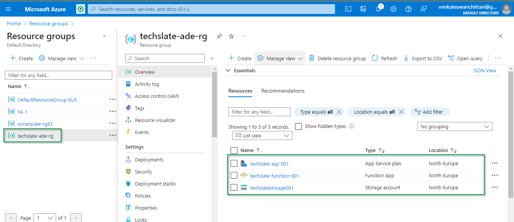

# Introduction 
 This is the terraform script to create Resource Group,storage account,FunctionApp and AppService Plan using modules.

# What is Resource Group?
 - A resource group is a logical container in Microsoft Azure that holds related resources for an Azure solution. It's a way to group Azure resources such as virtual machines, storage accounts, databases, and networking components together for organizational and management purposes.

# What is Storage Account?
 - A Storage Account is a fundamental resource in Microsoft Azure for storing various types of data such as blobs (objects), files, queues, tables, and disks. It provides scalable, secure, and durable cloud storage solutions for applications and services deployed on Azure. 

# What is Function App? 
 - A Function App in Microsoft Azure is a serverless computing service that enables you to run event-triggered code without needing to manage the infrastructure. It allows you to focus on writing code for your application's functionality while Azure handles the scaling, management, and maintenance of the underlying infrastructure.

# What is App Service Plan? 
 - An App Service Plan in Microsoft Azure is a set of compute resources (such as virtual machines) allocated to run and scale applications hosted within Azure App Service. Azure App Service is a fully managed platform for building, deploying, and scaling web applications, mobile backends, and API endpoints.

# What are Modules?
 -  Modules are self-contained units of configuration that can be used to define and manage resources in a reusable and modular way.
 - Modules allow you to encapsulate specific pieces of infrastructure logic, parameters, and configurations into a separate directory or package, making your Terraform code more organized, maintainable, and reusable.  
# Folder Structure
 	main 
        main -> which has main terraform scripts
        variables -> is having all the variables and default values
        providers.tf -> is having all the providers required
        README.md -> is containing all the help
    modules  -> will have all the sub folders where respetive modules are written
        appserviceplan
        functionapp
        resourcegroup
        storageaccount

# Pre-requisites
   1. Need to have Azure service principal -> with contributor role is assigned
   2. Set below envirnment variables
	    ARM_TENANT_ID
	    ARM_SUBSCRIPTION_ID
	    ARM_CLIENT_ID
	    ARM_CLIENT_SECRET

# Terraform commands
 - Terraform workflow commands for managing infrastructure.
### terraform init:
  - This command initializes a new or existing Terraform configuration. It downloads any required providers and modules specified in your configuration and prepares your working directory for Terraform operations.
### terraform validate:
  - This command validates the syntax and configuration of your Terraform files. It checks for errors or typos in your configuration and ensures that the configuration is valid before proceeding further.
### terraform plan:
  - This command generates an execution plan based on your Terraform configuration. It compares the current state of your infrastructure (as tracked by Terraform state files) with the desired state specified in your configuration and determines what actions need to be taken to achieve the desired state.
### terraform apply:
  - This command applies the changes described in the execution plan generated by terraform plan. It creates, updates, or deletes resources as necessary to bring the actual infrastructure state in line with the desired state specified in your Terraform configuration.
### terraform destroy:
  - This command destroys all the resources managed by your Terraform configuration. It reads the Terraform state to identify all resources associated with your configuration and prompts you to confirm before deleting them. This is useful for cleaning up resources after you're done testing or when you no longer need them.

# How to run Terraform commands?

  - Run all the terraform commands from tf_main folder.
  - No need to import/reference. With in the folder, terraform understands and reads all the .tf files
   
  ```
   terraform init
   ```

   

  ```
   terraform validate
   ```
   

  ```
   terraform plan
   ```
   

   

 ```
   terraform apply
   ```
   

   

### Now all the resources are created in Microsoft Azure portal.

   

 ```
   terraform destroy
   ```
    

    
# Description
 - The module declaration specifies the source of the module, input variables that are expected to be passed to the module, and the values of those variables.
 - When Terraform executes this configuration, it will load the module from the specified source, passing the provided variable values, and apply the configuration defined within the module to create or manage the Azure resource group accordingly.    

